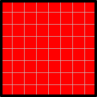
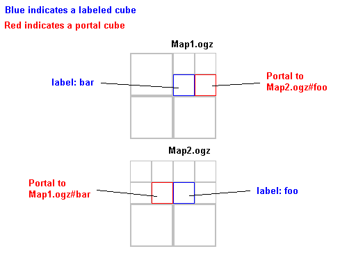

Wiki remains

The original Sauerbraten wiki met with an unfortunate accident when it
was targeted by linkfarm bots. The text in this html is the unique
information that was in there, in no particular order.

Some of this material could be refactored / integrated in the docs if
need be, but at least it is preserved for the time being.

I\'d rather have some serious people work on the official docs than
restarting the wiki, it is just too much admin hassle.

Portals

Sauerbraten Portal Scheme (Occlusion Culling).

Right now, Sauerbraten performs no occlusion culling. This is not a big
issue right now, as it has very efficient geometry throughput, levels
are relatively small, and the average graphics card nowadays seriously
overpowers sauer\'s modest rendering requirements.

As we move to the future, 2 things will make this problematic: first,
shaders will increase the fillrate & pixelshader load, and in
combination with larger levels (causing more overdraw), this will make
the engine entirely fillrate/pixelshader bound.

LOD will not help much here. Heavy fog can help but is a nasty solution.
For many kinds of levels, real occlusion culling will be required.

Occlusion culling is not trivial in sauer, because of its highly generic
scene structure. One simple scheme that makes most sense on todays
hardware is portals.

This is how portals will be implemented in Sauerbraten (again, there is
no urgent need for it right now, there are other things to be
implemented first).

-   level designers mark a selection of solids, and then execute a
    \"makeportal\" command. This will mark all cubes involved as
    \"portal\" and also make them nonsolid. Portals generally are placed
    in visibility bottleneck between larger areas, for example a doorway
    going into another room. The side of the selection that has the grid
    on has special meaning: this is the actual portal surface. The
    engine will keep track of these portal surfaces (the cube refers to
    the portal number).

<!-- -->

-   as a preprocess phase it now recomputes all sectors (at some point
    we will combine \"calclight\", \"remip\" and \"sectorize\" into a
    single command to make a level suitable for distribution). What this
    does is very simple: repeat until all cubes are sectorized:
    -   grab a non-solid cube
    -   flood fill all cubes reachable from there, not crossing solids
        or portal cubes. semi-solids have to be treated with care to see
        where to flood fill.
    -   mark all these cube with a sector number. A sector structure
        this refers to holds a list of all portal numbers found during
        this traversal
    -   portal cubes are made part of the sector which is not on the
        side of the portal plane

<!-- -->

-   now when sauer goes through its process of generating vertex arrays
    for the level, it effectively treats each sector as a seperate
    level. When a surface gets generated (which, by definition, is
    because it touches a non solid cube), the sector of that cube gets
    checked and the surface added to the vertex arrays of that sector.

<!-- -->

-   This all means the following addition data
    -   two numbers in a \"cube\" structure: portal and sector.
        portal==0 means no portal
    -   a boolean in the map header that says wether sector information
        is valid. it gets set after a sectorize, and reset whenever
        geometry is edited
    -   a vector of struct portal, each of which has 2 sector ids, and
        portal surface dimensions
    -   a vector of struct sector, each of which has a vector of portal
        ids, and a list of vertex arrays

<!-- -->

-   when rendering, do the usual portal things. For the record: Find the
    sector the camer is in, and render it. Find the list of portals.
    Test each with the view frustrum and only retain the visible ones.
    Render all sectors connected to the visible portals. Collect the
    list of portals touching those sectors, and intersect them with the
    first set of portals, rather than the view frustrum. With correct
    portal placement, this soon reduces the set of visible portals to
    zero, and thus rendering is done.

Of couse highly effective in indoor, it can still help in outdoor,
though fog & LOD may be additionally required to help. Fog + portals can
still cull effectively outdoor, i.e. an area can be culled from
rendering even though it is within the fog distance, because the portal
to it is outside the fog distance. Clever use of mountains and large
buildings can help.

Placing too many portals can hurt performance, as sectors fragment GPU
workloads. Sectors need to be at least an entire detailed \"room\" or
area.

Implementation is well defined, but a fair bit of work making it all run
smooth.

Heighfields

Algorithm for creating heighfields in Sauerbraten.

The problem is that you can\'t create a heighfield of more that 1 cube
high, as then slanted surfaces would cross cube boundaries, and not all
combinations are representable.

Solution: create the heighfield (I have a very good noise function).
heighfield will be created inside the current 3d selection, taking into
account grid size and orientation. Example, a 10x10 heighfield 5 deep
has 40 (5x8) possible heighlevels.

First pass: go through all X and Y edges and detect the ones that cross
a cube boundary (e.g., out of 0 to 40 depth, an edge doing from 2 to 8
doesn\'t cross a boundary, but one that goes from 2 to 9 does). Snap the
height of the corner closest to a cube boundary, in this case make the 9
an 8. After this, there is the possibility that an edge will span 2
cubes still\... the higher of the 2 then has to be brought down till
that is no longer the case.

After this, it is trivial to generate the actual cube data structures.

For heighfield editing functions such as applying a raise/lower circular
\"brush\" to terrain, you can have a function to compute heighfield data
from the current cube nodes, apply the operation, then apply the above
algorithm again.

This will do some damage to the heighfields form, but hopefully not that
much, and will give the heighfield its own style.

New Weapons

### Discussion can be followed [here](http://cubeengine.com/forum.php?action=display_thread&thread_id=237)

\...coding new weapons.

So it\'s my duty to detail step 2. ;)

I sure hope that you\'ve guessed you\'ll need to edit weapons.cpp. Add
required stuff in cube.h Modify the weapon selection commands to be able
to select it. Then you need to make ammo for it, use the .md2 of any
weapon ammo, and edit the skin.jpg with a nice logo for your new shiny
weapon. make a items\_yourmodname.png with original Cube items, but this
one is 256\*256 instead of 192 so you can add new nice stuff, and modify
renderextras to display your weapon logo on the HUD Then modify
something like -don\'t remember- world.cpp or editing.cpp so that you
can do /newent ammoforthisweapon eventually model a hudgun or use an
existing one. I think i didn\'t forgot something.

You should eventually wait that i release the modbase, i\'ve added some
new weapons in it, and am planning modifying a bit the code to make
adding new weapons easier, plus there is a new moveprojectiles function
to use weighted projectiles with curve path and bouncing ones (Cube
weaponfactory ;) But since that already playing with Cube source to
understand and know it well is fun :)

\-- D.plomat

This is the area you can change in weapons.cpp if you desire to just
modify an existing weapon. Adding weapons as D.polmat says requires more
than one file edit.

\-\-\-\-\--8\<\-\-\--cut here\-\-\-\-- struct guninfo { short sound,
attackdelay, damage, projspeed, part; char \*name; }; const int
MONSTERDAMAGEFACTOR = 4; const int SGRAYS = 20; const float SGSPREAD =
2; vec sg\[SGRAYS\]; guninfo guns\[NUMGUNS\] = { { S\_PUNCH1, 250, 50,
0, 0, \"fist\" }, { S\_SG, 1400, 10, 0, 0, \"shotgun\" }, // \*SGRAYS {
S\_CG, 100, 30, 0, 0, \"chaingun\" }, { S\_RLFIRE, 800, 120, 80, 0,
\"rocketlauncher\" }, { S\_RIFLE, 1500, 100, 0, 0, \"rifle\" }, {
S\_FLAUNCH, 200, 20, 50, 4, \"fireball\" }, { S\_ICEBALL, 200, 40, 30,
6, \"iceball\" }, { S\_SLIMEBALL, 200, 30, 160, 7, \"slimeball\" }, {
S\_PIGR1, 250, 50, 0, 0, \"bite\" }, }; \-\-\-\-\-\-\-\-\--end
cut\-\-\-\-\-\-\-\-\--

Take note of the structure, the first variable is the sound it makes.
And part should be zero unless your weapon has a visible projectile.

\-- Slipstream

Building on windows

Below is a short guide for allowing programmers to edit and compile
Sauerbraten source code on Windows.\
Keep in mind that the batch file for this guide is also available
[here](http://cube.snieb.com/node/92) .

First you need msys and mingw. Get them here: <http://www.mingw.org/>
First install mingw into (recommended) c:\\msys\\mingw and then install
msys into c:\\msys. Add C:\\msys\\mingw\\bin (or wherever
mingw32-g++.exe is) to your path (Control Panel -\> System Properties
-\> Advanced -\> Environment Variables -\> Edit System Variables).
You\'ll know you got the path right when you can run \"mingw32-gcc -v\"
from a command window anywhere and not get an unknown command error.

Now grab this: (you need to download the cvs program in order to grab
the source files)
<https://ccvs.cvshome.org/files/documents/19/886/cvs-1-11-20.zip>\
or if it\'s been a long time since I wrote this a newer version from:\
<https://ccvs.cvshome.org/servlets/ProjectDocumentList?folderID=83&expandFolder=83&folderID=80>\
Place cvs.exe in c:\\windows or some other folder in your path.

Create a bat file in c:\\ and put in there: (or download it from
<http://cube.snieb.com/node/92> )\
cvs -d:pserver:
[anonymous»cvs](http://strlen.com/wiki/index.php?id=ProtectedEmail&encoded_email=Sj5gPmJFYFs4NVlTOFo4YFtyWUJXYHJ4Qlo%2BQnA%3D)
:/cvsroot/sauerbraten login\
cvs -z3 -d:pserver:
[anonymous»cvs](http://strlen.com/wiki/index.php?id=ProtectedEmail&encoded_email=Sj5gPmJFYFs4NVlTOFo4YFtyWUJXYHJ4Qlo%2BQnA%3D)
:/cvsroot/sauerbraten co -P sauerbraten\
PAUSE

If that worked, you\'ll now have a c:\\sauerbraten. Usually the exe
isn\'t too far behind, but the latest features may only be in source. To
get those run c:\\sauerbraten\\make.mingw.bat. If that errors on your
first try you\'re probably SOL and will need to wait a day for a version
that builds. If errors on subsequent builds then the header probably
changed and you should run makeclean.mingw.bat and try again. If it
built and it most likely did, go to c:\\sauerbraten\\sauerbraten\\ and
copy the sauerbraten.bat file and edit it to refer to
bin\\sauerbraten-mingw.exe instead of bin\\sauerbraten.exe. Change the
resolution to your liking and enjoy!

If you like, you could also download and install Bloodshed\'s Dev-C++
for a good lightweight IDE to aid in reading all the sourcecode.
<http://www.bloodshed.net/devcpp.html>

Ambient Lighting

(From Sauerbraten engine development thread)

post\#980: Re: ambient lighting

by Aardappel\_ on 07/03/2005 16:43

Yes there is already ambient light, fixed at about 10%

For those of you who think shadows are all black: you either have a very
crappy monitor or have weird settings (like super high contrast).

The reason **ambient lighting**
[?](http://strlen.com/wiki/index.php?id=ambient+lighting) is fixed is
because 99% of the time people want to raise it, they do so is for the
wrong reasons. Repeat after me: GOOD LIGHTING SHOWS CONTRAST. Not every
polygon needs to be touched entirely by light. Shadows are good (if
people hiding in the dark is a problem gameplay wise, we will solve that
otherwise\... they already show up less dark).

Learn to light levels properly. Start with the biggest, most prominent
lights first and continue on down as required. For many levels that
means the correct placement of a sunlight (newent light 0 255 200 100)
somewhere high up.

see also

-   [post
    986](http://cubeengine.com/forum.php?action=display_thread&thread_id=286&start=986)
-   [post
    987](http://cubeengine.com/forum.php?action=display_thread&thread_id=286&start=987)

This post is pretty much straight from the sauer dev thread
[here](http://cubeengine.com/forum.php?action=display_thread&thread_id=286&start=960)

I added some punctuation, fixed capitalization, and added a few words so
it would make more sense.

edited by mreynolds

Sauerbraten future development timeline

+-----------------------------------------------------------------------+
| A lot of people are interested in Sauerbraten for different reasons.  |
| And even though I still control it, the development of it is more     |
| open, and more people influence it than Cube.\                        |
| \                                                                     |
| For an open source project to be successful, there needs to be a      |
| balance between the community, and a person with a central vision. A  |
| lot of things that are cool about cube, and now sauerbraten again, is |
| because I had a particular design vision. A community without         |
| leadership will not produce good designs. So for Sauerbraten I want   |
| to continue setting clear goals for whoever works with me on it, but  |
| at the same time I want to be more open to make sure it is ideal for  |
| a larger community, and I especially want to accommodate the larger   |
| contributors, meaning the programmers that may have their own plans,  |
| and the more active level designers.\                                 |
| \                                                                     |
| So without further blah, here\'s how I see the development phases of  |
| Sauerbraten.\                                                         |
| \                                                                     |
| 1) Get the core engine tech to a stage where the engine is fully      |
| usable.\                                                              |
| STATUS: We just finished this stage! Congrats to all involved!\       |
| \                                                                     |
| 2) Get a basic FPS game along the lines of Cube, but slightly         |
| enhanced, up and running. For those of you who are wondering what the |
| point of this step is: the biggest failure of most engines is that    |
| they are engines, not games. It is very hard to take an engine an     |
| build a game for it without an existing framework. Many people are    |
| interested in using sauerbraten as a base for a game. And what is the |
| most basic gameplay you could give a 3D engine? that\'s right, an     |
| FPS. Especially since we already have the base cube gameplay to work  |
| from.\                                                                |
| STATUS: we are 70%-80% done on this one, I estimate. Most of it       |
| appears to work, but a lot of refinements can be made. At some point  |
| this gameplay will be mostly frozen, much like Cube. Most importantly |
| we need to figure out how we want to do multiplayer, given that       |
| currently it is wide open for cheating.\                              |
| \                                                                     |
| 3) \[this can actually be in parallel with 4 & 5\]: improve engine    |
| tech. Geometry thruput optimisations, Level of Detail, Occlusion      |
| Culling, and a shader system are the most important items on the list |
| here, but there are tons of other features that will keep on          |
| enhancing/refining the engine.\                                       |
| STATUS: planning/design. Currently we are not in a total hurry with   |
| these features as the engine is running rather nicely already. But we |
| can do better and we will.\                                           |
| \                                                                     |
| 4) Gameplay & Engine seperation. Several people want to do widely     |
| different games with Sauerbraten. I don\'t want us to get in the same |
| situation as most engine (Cube especially) where making a \"mod\"     |
| means forfeiting future engine development, or worse, mods add their  |
| own cool features that don\'t benefit the main branch. That\'s why I  |
| want to organize a system whereby we can have a main, shared engine,  |
| and multiple gameplay modules. For this it is also important to have  |
| the FPS gameplay polished, that way every gameplay module can be      |
| based off the FPS module and have something working to start with.\   |
| Even better, since this item will require a LOT of reorganisation in  |
| the engine, there will be quite a bit of time afterwards where things |
| have to be restructured. To do this most smoothly, I will propose an  |
| organisation where all main gameplay projects (serious ones, approved |
| by me) sit together in the same CVS, and initially even in the same   |
| program, toggleable by a commandline switch. This means that if you   |
| change the engine or the gameplay interface, you get to compile other |
| people\'s gameplay modules as well, and verify wether you haven\'t    |
| broken their code, or even make simple fixes (such as when adding     |
| additional parameters etc.).\                                         |
| I am also open to thinking about a better scripting language, if time |
| permits I will create one, such that we can move as much as possible  |
| out of the engine and allow non C++ programmers to make mods.\        |
| STATUS: I will do the initial engine restructuring to allow this to   |
| happen, but I\'d like to postpone this as long as possible.\          |
| \                                                                     |
| 5) The sauerbraten RPG. This will be the main gameplay module         |
| seperate from the FPS module, designed by yours truely. I have        |
| particular ideas for this, but since our life will be simpler if we   |
| don\'t have 3 million different gameplay projects ongoing (we also    |
| have a limited pool of level designers), I will try to scope this     |
| project such with major programmer & level designer contributors such |
| that we can all work on a single project, if possible. It may be that |
| our wishes are non-unifyable, so be it, but I will give it a try. I   |
| think it can be done.\                                                |
| STATUS: Once we are past (4) and some of (3), I will lay out my       |
| plans\... but if you dig through old threads on this forums you can   |
| find some of it :)\                                                   |
+-----------------------------------------------------------------------+
| {width="1" height="20"}                      |
+-----------------------------------------------------------------------+

Wiki usage

The Cube forum ( <http://www.cubeengine.com/forum.php> ) contains many
large posts containing valuable information, which all too often is very
hard to find.

From now on, whenever I am explaining something that is a larger text, I
will put it on the wiki and link to it on the forum instead. That way it
will be easier to build up a knowledge base.

The first example is my post about portals.

I strongly encourage you to do the same. Let\'s build this wiki up
together and make it a dual to this forum. Knowledge goes in the wiki,
temporal stuff and discussion goes in the forum. Things can move from
the forum to the wiki once discussion has reached a conclusion.

Infact, I would be VERY grateful if someone wants to go through old
threads and isolate the most valuable posts, and put them in the wiki in
a logical way.

What the wiki is for:

The main focus for the wiki is Sauerbraten. That means that any wiki
page not marked otherwise is about sauer. It also be nice to collect
Cube information in the wiki, but it needs to be marked as such, since
eventually sauer will take over entirely. So, for example,
**EngineFeatures**
[?](http://strlen.com/wiki/index.php?id=EngineFeatures) is about sauer,
and **CubeEngineFeatures**
[?](http://strlen.com/wiki/index.php?id=CubeEngineFeatures) is about
Cube.

I welcome additional pages that are indirectly related to these 2
engines. Examples are pages about engines & engine algorithms in
general, about gameplay, level design, tools, art, or even about any of
my other projects.

There are two main uses however, and that is documentation about
sauerbraten for players and mappers on the one hand, and for developers
(engine specifics) on the other hand. So those should take the
forefront. Make a very clear distinction between something that is
\*information\*, and something that is just your \*idea\*. I know people
have written interesting texts on their ideas for gameplay, or certain
engine features. Until I or any of the other main contributers are
implementing them, these are not part of the project. So seperate ideas
out by making a wikipage for yourself (e.g. **PushPlay**
[?](http://strlen.com/wiki/index.php?id=PushPlay) ) and then link your
ideas from there (e.g. **PushPlayGameModes**
[?](http://strlen.com/wiki/index.php?id=PushPlayGameModes) ), rather
than putting them in to the main documentation directly. Ideas are still
welcome, but for a random new user that needs help on the engine, it
should be easy to distinguish fact from fiction.

This wiki comes with a bunch of admin tools, that allow me for example
to roll back a page or the entire wiki. That should allow protection
against spam bots & griefers. We will see how this goes. If we get too
much trouble we may move to a more private wiki. I will also at some
points give admin rights to some trusted contributers. Please alert me
if you think a major attack on the wiki has been made. For small
problems, just fix them yourself. The wiki stores all its content in a
bunch of flat files, which allows us to do frequent backups, export to
offline html, and easy migration.

Edge Spans

The method that
[Sauerbraten](http://strlen.com/wiki/index.php?id=Sauerbraten) uses to
describe deformed cubes consists of the start and end location of each
edge of the original cube. These start and end locations, along with
those of the other 11 edges, define 6 faces. For a complete, normal,
solid cube those 6 faces form an actual cube shape, with start and end
locations at their maximum distance from each other. Once you begin
deforming the cube those planes begin to carve out the sides of the
cube, and what is left inside the intersections of the planes is the
resulting smaller deformed cube.

Here is an illustration of this concept in 2D, using only 4 edges to
define a deformed square. Notice that as the edges are pushed in, the
remaining portion of the square is whatever is left inside the edges. In
this illustration the start of the span for the top and left edges is
being pushed in.

{width="193" height="193"} (no picture means the wiki
is still broken, two pictures means the page should be edited)

Notice that while the edge spans always start and end on integer grid
marks, the resulting corners of the deformed cube often do not. Also
note that the deformed cube tries to avoid becoming concave. This means
that in some cases you get prettier corners because of better
approximations of curves, and that the rendering code can be very
elegant, but it also means that many conceivable shapes inside a cube
cannot be realized.

Using free tools to produce .md2 models

In this small tutorial I will try to explain how to use Blender v2.36
with the Quake 2 modeller to produce and texture a simple mesh for use
with Cube.

Disclaimer: I can\'t guarantee that the tutorial will be of any use to
anyone. If you arise damages from the tutorial, I don\'t want to know
about it.

What we need:

=\> Blender 2.36 and the Blender md2 import/export scripts by Bob
Holcomb (script files must be put in the .blender/scripts folder in
order to work)

=\> The Quake 2 modeller by Phillip Martin and Jaimi **McEntire**
[?](http://strlen.com/wiki/index.php?id=McEntire) (hopefully v0.91b)

First let\'s start by creating a cube in Blender. I assume you have some
basic knowledge on how to use this program, otherwise from now on it may
be a little hard to follow. Place the cursor in a 3D View window, hit
spacebar and select add=\>mesh=\>cube. In edit mode, press A to select
all if needed (not needed in our case because all is selected by
default, but good to know anyway), then click the Mesh menu and select
faces=\>convert quads to triangles. Use keypad 1, 3 and 7 or SHIFT + the
latter to change top and side views. Keypad 5 switches between
perspective and orthogonal view. Once you\'ve chosen a view enter UV
face select mode and press U. Choose Bounds to 1/1 or experiment with
other options. When you\'ve made your choice enter the UV/Image editor
window, select an image, go back to 3D view, enter Object mode and press
ALT+Z to see your model textured. If you have difficulty with all those
hotkeys look for corresponding commands in the menus, personally in most
cases I find it more convenient to use a hotkey.

After you export the mesh, open the .md2 file with Quake 2 modeller. You
need to have UV mapped the mesh in Blender even if you didn\'t select a
texture, otherwise it may not load properly. Select, move, scale, manage
frames, export to md2 and try with Cube.

This way of producing Cube model data is not very reliable. Nonetheless,
I think the information presented here or parts of it may be useful to
Cube people.

Troubleshooting

#### Rockets explode in your face or bullets do not fly.

This happens due to buggy ATI drivers for unix/linux operating systems.
Download the fix from Sourceforge-
<http://sourceforge.net/project/showfiles.php?group_id=91993> Once you
have downloaded the file, unzip it and you will discover a file named
linux\_client. In your Cube folder, there is a folder called bin\_unix,
which contains a file with the same name as the one you have just
unzipped (linux\_client). Simply replace the linux\_client file in there
with the new one. Cube should now run correctly.

#### error loading shared libraries

This is quite a common error. Something like - error while loading
shared libraries: libSDL\_image-1.2.so.0: cannot open shared object
file: No such file or directory

This means you do not have the SDL libraries installed (or possibly that
you are running a 64bit version of Linux) You need to install the SDL
libraries for the following SDL types- SDL SDL\_gfx SDL\_image
SDL\_mixer SDL\_net SDL\_sound SDL\_ttf Note: For 64 bit Linux, you may
be able to run Cube with 32 bit emulation if there is a 32 bit emulated
library for SDL in your distro. But Cube is a 32 bit game and I
personally have had no success with running it on a 64 bit distro.

#### ALSA sound errors

ALSA lib pcm\_hw.c:1155:(snd\_pcm\_hw\_open) open /dev/snd/pcmC0D0p
failed: Device or resource busy Fatal signal: Segmentation Fault (SDL
Parachute Deployed) Or a similar message means that your ALSA driver is
currently in use. Shut down any program which may be using it. Also
worth noting - if you run KDE, go to the KDE Control Centre, click it
and select the Sound and Multimedia tab. There, select the Sound System
tab. This will open the Sound System settings. Near the bottom is a
sliding button marked auto-suspend if idle after\... Slide this to the
lowest setting (1 second) and ensure the tick box is checked next to it.
Apply as usual.

#### couldn\'t load texture data/newchars.png

If you get this error trying to run Cube, it means you are attempting to
run the actual binary in the /bin\_unix folder. To run cube, simply
navigate to the cube directory and run the cube\_linux shell script. See
the installation page of the Wiki for further details on how to run Cube
in Linux.

#### Screen goes black and then returns to my desktop

Various errors can cause this problem. To discover exactly which one is
causing your issues, try running Cube from a command line. This will
give an error message which you can then check against this
Troubleshooting guide.

#### libGL error: open DRM failed (Operation not permitted) libGL error: reverting to (slow) indirect rendering

The DRI interface to your card can\'t be accessed directly because Linux
has set restrictive access permissions on it for security (eg. 660). Fix
this by changing the permissions to 666. Exact details vary, but here
are some examples:

chmod 666 /dev/dri/card0 (Gentoo 2.6.8 x86 with ATI Radeon 7000/VE)\
chmod 666 /dev/nvidia\* (Gentoo 2.4.26 x86 + nVidia 5200, and 2.6.11
x86\_64 + nVidia 6600)

If you find that your fix keeps getting reset on boot, then edit the
file /etc/security/console.perms \-\-- just remove all lines containing
\"\<dri\>\" if the \<dri\>= line mentions any of the /dev entries above.
Or alternatively, don\'t delete anything but change the \<dri\>
permissions numbers to 0666. Take a copy of the original file first
before you hack it, of course.

#### Something about old versions in multiplayer online games\.....

#### Something about compiling from source making your Cube incompatible with online games\....

 

Installing Cube

Firstly, download the latest Cube release from
<http://sourceforge.net/project/showfiles.php?group_id=91993>

Now you can unzip it in whatever directory you wish to run the game from
- most likely this will be your home directory. How you unzip it is up
to you - choose whichever method you are most comfortable with - if you
have KDE and have installed the KDEutils package, then Ark will probably
be the easiest way - but gunzip or the tar command also work fine. This
will create a folder called cube. Thats it - there is no make or other
commands to run - cube is ready to roll!

Cube needs the SDL libraries to run - so you need to check out your
distributions file repository or your CDs to get hold of these. If you
cannot locate them,then they can be obtained from
<http://freshmeat.net/projects/sdl/> in various formats - though if
possible, your distros file repository or CD is a lot easier.

To run cube,you do not click the binary file as you may think. You need
to use the command line to cd into the cube folder, then once there, you
use the command

./cube\_unix

to start the game. You can pass parameters to this command to alter, for
instance,the screen size -

./cube\_unix -w1024 -h768

for instance sets a 1024x768 screen. Passing -t ( with or without the -w
and -h settings ) runs cube windowed. There are other options - feel
free to explore the documentation which comes with Cube.

Tip - If intending to play online, please set a username and team name
in the autoexec.cfg file - there are too many Unnamed players on Team
Blah ;)

### Distribution-specific information

Although there is considerable variation in how different distros manage
libraries and dependencies, the list of top-level dependencies specified
in the sources tree is fairly constant:

libGL.so.1\
libGLU.so.1\
libz.so.1\
libjpeg.so.62\
libpng.so.3\
libSDL-1.2.so.0\
libSDL\_image-1.2.so.0\
libSDL\_mixer-1.2.so.0

The subsections below give some information on how these are satisfied
and/or any distribution-specific installation details. If you are having
trouble, check out the
[Troubleshooting](http://strlen.com/wiki/index.php?id=Troubleshooting)
page.

#### Gentoo x86

NOTE: As of 11/21/05 it appears that the gentoo Portage version
described below is out of date. Anyone know who is responsible for
maintaining the cube package in gentoo?

If you\'re running Gentoo on x86 hardware, at the time of writing (25
June 2005) there is a Gentoo ebuild (games-fps/cube-20040522) for the
latest platform-independent Sourceforge download which is \"
**2004\_05\_22** [?](http://strlen.com/wiki/index.php?id=2004_05_22)
.tar.gz\". This makes installation very easy, since dependencies will be
resolved automatically and any necessary packages will be brought in
first.

To install, just login as root and type \"emerge cube\". Then, as an
ordinary user in an xterm window, just type \"cube\_client-bin\" to play
in fullscreen, or \"cube\_client-bin -t\" to play in a window.

This assumes that you have /usr/games/bin in your path. If you don\'t,
then \"export PATH=\$PATH:/usr/games/bin\" will add that directory to
your path. Or do yourself a favour and set up a symlink \"ln -s
/usr/games/bin/cube\_client-bin /usr/local/bin/cube\", so that you can
run Cube by just typing \"cube\".

For reference, Gentoo x86 on a 2.4 box with nVidia graphics satisfied
the install dependencies with these ebuilds automatically:

media-video/nvidia-kernel-1.0.6629-r4\
media-video/nvidia-glx-1.0.6629-r6\
sys-libs/zlib-1.2.2\
media-libs/jpeg-6b-r4\
media-libs/libpng-1.2.8\
media-libs/libsdl-1.2.8-r1\
media-libs/sdl-image-1.2.3-r1\
media-libs/sdl-mixer-1.2.6\
games-fps/cube-20040522

#### Yoper 2.x

In the 2.x Yoper repositories, you will find all the SDL libraries
needed for Cube. Simply use either the synaptic program and install the
SDL libs, or, if you prefer the command line, use the apt-get command.
There is a Yoper Cube team thread within the forum on the Yoper site
should you wish to chat about the game - or join in with the team games
which we run from time to time. Currently, there is no Cube rpm in the
repositories - however the Cube installing information at the top of the
page will allow you to install Cube easily.

TOGoS\'s Map Linking ideas

Map linking in Sauerbraten is completely theoretical at the moment.
Development is not yet to that point, and it is not clear that it ever
will be. It does seem like a terrific idea, though\...

### A possible way to implement map linking

First, cubes can be named. This may be as in Cube where a set of map
cells are given a tag number, or it may take the form of an actual text
name. This is useful for obvious reasons: once a cube is named, you can
reference it to script operations like \"copy the contents of cube
\'doorA-open\' to cube \'door1\'\" for more dynamic maps.

Second, cubes can be marked as referencing external maps. For instance,
you might select a cube and say to sauer \"make this cube an
instantiation of \'TOGoS/cool-pillar.ogz\'. Similarly, you could make
the cube a portal rather than a simple instantiation. The difference
being that when the player enters a portal cube, he is seamlessly
teleported to the specified section of the referenced map.

Now for portals, instead of referencing an entire map, the cube would
reference only a named part of a map. This way we avoid the problem of
having a link to a map that has a link to us and ending up having an
infinite number of our map within the linked to map :)

This diagram shows what I am talking about:
{width="512"
height="384"}

Note that the idea of loading maps off remote web servers is totally
unrelated to multiplayer games.

Also as proposed by **JerryBean**
[?](http://strlen.com/wiki/index.php?id=JerryBean) a while back, I think
having a linked list of name=\>value attrivutes for each cube would be
very helpful for this kind of thing. ( \"id\"=\>\"foo\" to set the name
of a cube, \"object-url\"=\>\"TOGoS/chair1.ogz\" to use an ogz-based
model, \"portal-url\"=\>\"TOGoS/maps/coolio.ogz\#main\" to link to
another map ).

### Pseudo-random infinite worlds using a server-side map generator

Say map linking was implemented as described above, allowing links to
maps using HTTP. There\'s a directory (or what appears to be a
directory, anyway) on a web server containing an infinite number of
sauer maps, like so: <http://mycoolsauermaps.com/world15/+12-8+4.ogz> .
When the Sauerbraten engine sees that that map is linked to, it will
fetch it from that URL. As far as Sauer is concerned, there is nothing
special about that map.

But that map might not actually exist. If nobody has uploaded such a map
to the server (presumably using a fancy version of savemap, maybe
requiring a password, probably implemented with HTTP PUT), a program on
the server will automatically generate such a map. In this case the
numbers +12-8+4 have a special meaning - those are the coordinates of
the map. This map would in turn have links to maps +12-8+5, +12-8+3,
+12-7+4, +12-7+5, etc (26 links total - one in each direction, including
the diagonal ones).

 

 

 

 

 

 

 

 

 

 

 

 

 
